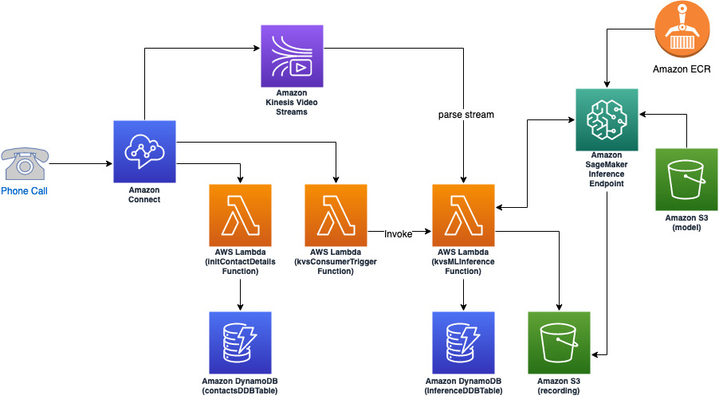
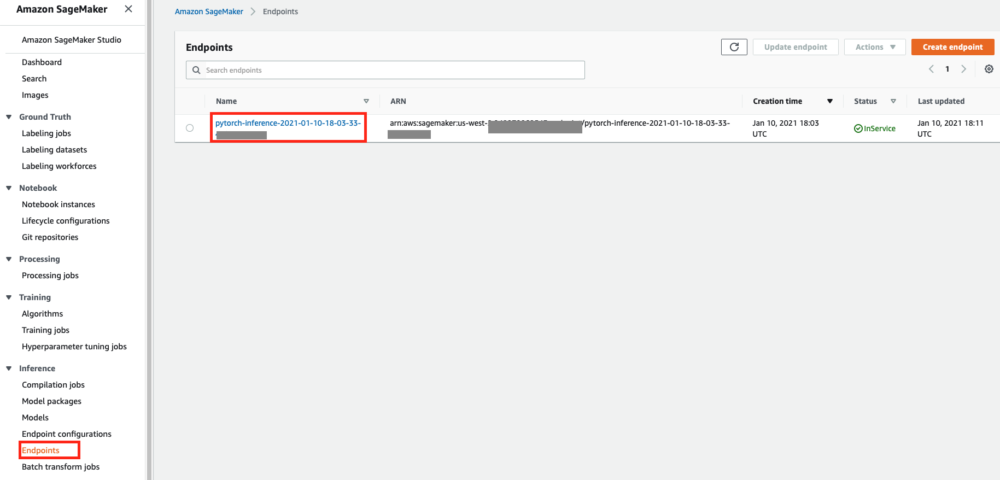
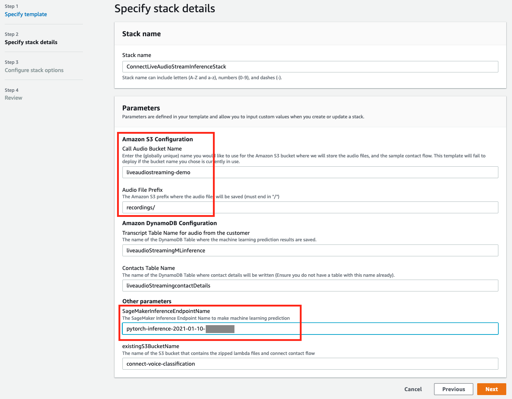
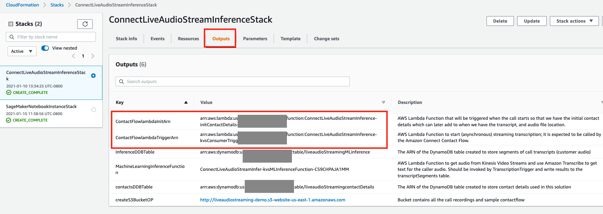
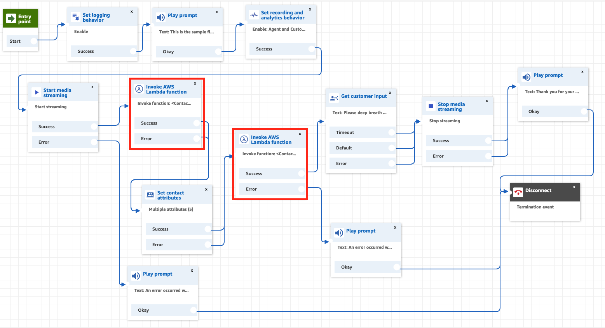

## Applying Voice Classification in Amazon Connect Contact Flows

## Overview Architecture

## Deployment Steps

### Step 1: Create SageMaker Notebook Instance to Train and Deploy Voice Classification Model

You can create the SageMaker Notebook instance using 1-click deployment button:

Feel free to change the notebook instance type if necessary. The deployment will also clone this GitHub repositories plus the GitHub repository for [Coswara data](https://github.com/iiscleap/Coswara-Data)

Go to a Jupyter notebook *coswara-audio-classification.ipynb* under the sagemaker voice-classification notebook folder to train and deploy the voice classification model. 

Take a note of the inference endpoint name, which will be used in the next step:  

It is noteworthy that the inference endpoint can be invoked by two types of request body defined in inference.py file:  
- a text string for the S3 object of the audio recording wav file  
- a pickled Numpy array   

The output is the probability of the positve class from 0 to 1, which indicates how likely the voice is unhealthy in this use case, defined in inference.py as well.

### Step 2: Create the Lambda Functions to Process Live Media Streaming and Make Inference

You can create the lambda functions to process live media streaming for the Amazon Connect contact flow and the DynamoDB tables to store inference results using 1-click deployment button:

You will need to fill in the S3 bucket name for audio recording and SageMaker inference endpoint as parameters:  

If you want to deploy this stack in other AWS regions, rather than US-EAST-1, or you want to make change to the Lambda functions, go to the [connect-audio-stream-solution](https://github.com/aws-samples/applying-voice-classification-in-amazon-connect-contact-flow/tree/main/connect-audio-stream-solution) folder and follow the steps for [AWS SAM](https://aws.amazon.com/serverless/sam/) deployment.

Take a note of the CFN stack outputs for the Lambda function ARNs, which will be used in the next step:

### Step 3: Set up an Interactive Voice Response using Amazon Connect

We will be using Amazon Connect contact flow to trigger Lambda functions, created in the previous step, to [process the captured audio recording](https://docs.aws.amazon.com/connect/latest/adminguide/customer-voice-streams.html) in Amazon Kinesis Video Stream, assuming you already have an Amazon Connect instance ready to use. If you do need to learn more about setting up an Amazon Connect instance, you can follow [the steps here](https://docs.aws.amazon.com/connect/latest/adminguide/amazon-connect-instances.html). You will need to follow [the instructions](https://docs.aws.amazon.com/connect/latest/adminguide/customer-voice-streams.html) to enable live audio streaming for your Amazon Connect instance as well. You can create a new contact flow by importing the flow configuration file downloaded here. You will need to claim a phone number and assiciate it with the newly created contact flow. There are two Lambda functions to be configured here: the ARNs of ContactFlowlambdaInitArn and ContactFlowlambdaTriggerArn in your CFN outputs tab deployed in previous step

After changing the ARNs for the Lambda functions, Save and Publish the contact flow. Now you are ready to test it by calling the associated phone number with this contact flow.

## Security

See [CONTRIBUTING](CONTRIBUTING.md#security-issue-notifications) for more information.

## License

This library is licensed under the MIT-0 License. See the LICENSE file.

